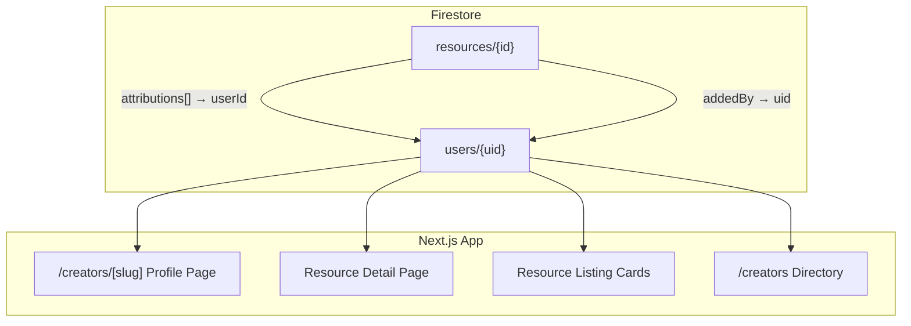
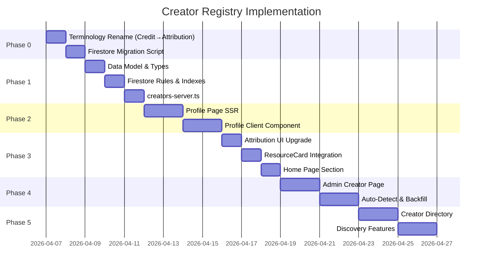

# ATTR_PLAN_1 — Creator Registry System

> **Status**: 📋 Draft — Awaiting Feedback  
> **Scope**: PromptResources  
> **Created**: 2026-04-06  
> **Amended**: 2026-04-06 — Terminology clarification (Credit → Attribution, Contributor → Creator)

---

## ⚠️ Terminology Decision

> [!IMPORTANT]
> The term **"credit"** has two distinct meanings in the Stillwater ecosystem:
> - **Attribution** (PromptResources): Acknowledging who created a resource (e.g. "Kevin Stratvert")
> - **Currency** (PromptTool, PromptMasterSPA, ag-video-system): Consumable tokens for AI actions
>
> To eliminate ambiguity, this plan renames the attribution concept from `Credit` → `Attribution`
> across the entire PromptResources codebase. Phase 0 handles this migration.

---

## 🎯 Objective

Implement a comprehensive **attribution system** that acknowledges and promotes the individuals who create resources curated on the platform. Every creator automatically gets a **public profile page** showcasing their creations, bio, and social links — turning PromptResources into a community-first curation platform.

---

## 📐 Current State Analysis

| What Exists | Where |
|---|---|
| `Credit` type (`{ name, url }`) — **to be renamed `Attribution`** | `src/lib/types.ts` — simple name/url pair per resource |
| `addedBy` field on `Resource` | `src/lib/types.ts` — Firebase UID of the submitter |
| `creator` object joined at query time | `src/lib/resources-server.ts` — `displayName` + `photoURL` hydrated from `/users/{uid}` |
| AI-suggested attributions on new resource form | `src/lib/suggestions.ts` — auto-detects YouTube author, known providers |
| Attribution section on detail page | `src/components/ResourceDetailClient.tsx` — renders attribution links with 👤 icon |
| `UserProfile` type | `src/lib/types.ts` — basic profile (uid, email, displayName, photoURL, role) |

### Key Gaps

- **Attributions are anonymous strings** — no linkage to a first-class user/creator entity
- **No public profiles** — clicking an attribution name leads to an external URL, not an internal profile
- **No aggregated view** — can't see "all resources by creator X"

---

## 🏗️ Architecture Overview



**Key Design Decision: The Unified Registry**. 
Every creator is just a user, and every user can be considered a creator. 
- **External Creators** (e.g., a YouTube channel) are initially created as **"stub" users** (they have no auth credentials, `isStub: true`).
- **Platform Users** use their normal auth accounts.
- If an external creator later logs into the platform, they can "claim" their stub profile, transitioning it into a fully active account.

---

## 🔤 Phase 0 — Terminology Migration (`Credit` → `Attribution`)

> [!NOTE]
> This phase is a prerequisite. It renames the existing attribution concept so all new
> registry code uses unambiguous terminology from the start.

### 0.1 Type Renames

```typescript
// src/lib/types.ts — BEFORE
export interface Credit {
    name: string;
    url: string;
}

// src/lib/types.ts — AFTER
export interface Attribution {
    name: string;
    url: string;
}
```

```typescript
// Resource interface — field rename
// BEFORE:
credits: Credit[];
// AFTER:
attributions: Attribution[];
```

### 0.2 Function Renames

| File | Before | After |
|------|--------|-------|
| `src/lib/youtube.ts` | `deduplicateCredits()` | `deduplicateAttributions()` |
| `src/lib/suggestions.ts` | `suggestCredits()` | `suggestAttributions()` |
| `src/app/resources/[id]/edit/page.tsx` | `addCredit()`, `removeCredit()`, `updateCredit()`, `applySuggestedCredit()` | `addAttribution()`, `removeAttribution()`, `updateAttribution()`, `applySuggestedAttribution()` |
| `src/app/resources/[id]/edit/page.tsx` | `credits` / `suggestedCredits` state | `attributions` / `suggestedAttributions` state |

### 0.3 CSS Class Renames

| Before | After |
|--------|-------|
| `.credit-card` | `.attribution-card` |
| `.credit-avatar` | `.attribution-avatar` |
| `.resource-card-credits` | `.resource-card-attributions` |

### 0.4 UI Label Changes

| Before | After |
|--------|-------|
| "Credits & Attribution" | "Attribution" |
| Section heading in detail page | Updated |

### 0.5 Firestore Migration (Backward-Compatible)

**Strategy**: Read `attributions ?? credits` during transition, write only `attributions` going forward.

```typescript
// In resources-server.ts and API routes — transitional read:
const attributions = doc.data().attributions ?? doc.data().credits ?? [];
```

- A backfill script (`scripts/migrate-credits-to-attributions.ts`) will copy `credits` → `attributions` on all existing resource documents.
- After backfill completes, the `?? credits` fallback can be removed.

### Checklist — Phase 0

- [x] Rename `Credit` → `Attribution` interface in `types.ts`
- [x] Rename `credits` → `attributions` field on `Resource` interface
- [x] Rename `deduplicateCredits` → `deduplicateAttributions` in `youtube.ts`
- [x] Rename `suggestCredits` → `suggestAttributions` in `suggestions.ts`
- [x] Update all imports and references across ~8 files
- [x] Rename CSS classes (`.credit-card` → `.attribution-card`, etc.)
- [x] Update UI labels ("Credits & Attribution" → "Attribution")
- [x] Add backward-compatible reads (`attributions ?? credits`)
- [x] Create and run `scripts/migrate-credits-to-attributions.ts`
- [x] Verify all pages render correctly after rename
- [x] Remove backward-compatible fallback once backfill is confirmed

---

## 📦 Phase 1 — Data Model (Unified User Registry)

### 1.1 Expanding the `UserProfile`

We enrich the existing `UserProfile` type instead of making a new collection:

```typescript
// src/lib/types.ts

export type CreatorType = 'individual' | 'channel' | 'organization';

export interface CreatorSocial {
    platform: 'youtube' | 'twitter' | 'github' | 'linkedin' | 'website' | 'other';
    url: string;
    label?: string;
}

export interface UserProfile {  // existing type, now expanded
    uid: string;
    email?: string;             // Optional for stub users
    displayName: string;
    photoURL?: string;
    role: UserRole;
    subscriptionType: SubscriptionType;
    
    // --- NEW: Public Profile Fields ---
    slug?: string;              // URL-safe unique handle (e.g. "kevin-stratvert")
    profileType?: CreatorType;  // Default: 'individual'
    bio?: string;
    bannerUrl?: string;
    socials?: CreatorSocial[];
    tags?: string[];
    isStub?: boolean;           // True if auto-created from attribution (no login yet)
    isVerified?: boolean;
    isFeatured?: boolean;
    resourceCount?: number;     // Denormalized count of attributed resources
    
    createdAt: Date;
    updatedAt: Date;
}
```

### 1.2 Updated `Attribution` Type

```typescript
export interface Attribution {
    name: string;
    url: string;
    userId?: string;          // ← NEW: links to the users collection
    role?: AttributionRole;   // ← NEW: what they contributed
}

export type AttributionRole = 'creator' | 'author' | 'presenter' | 'curator' | 'contributor' | 'source';
```

### 1.3 Firestore Rules Update

```
match /users/{userId} {
    // Public user profiles can be read by anyone
    allow read: if true; 
    
    // Normal self-edit rules for auth users...
    allow update: if request.auth != null && request.auth.uid == userId;
    
    // Admins can create/edit stub profiles
    allow create, update: if isAdmin();
}
```

### 1.4 Firestore Indexes

- `users` → `isFeatured` DESC, `resourceCount` DESC  
- `users` → `tags` array-contains, `resourceCount` DESC  
- Resources can be queried by `attributions[].userId` (requires flattened `attributedUserIds[]` array field)

### Checklist — Phase 1

- [x] Add `CreatorSocial`, `CreatorType`, `AttributionRole` types to `types.ts`
- [x] Expand `UserProfile` interface with new public profile fields
- [x] Update `Attribution` interface with optional `userId` and `role`
- [x] Add `attributedUserIds: string[]` denormalized array field to `Resource` type
- [x] Update Firestore security rules for `users` collection to allow public reads
- [x] Add necessary composite indexes to `firestore.indexes.json`
- [x] Create `src/lib/creators-server.ts` with query functions

---

## 🧑‍💻 Phase 2 — Creator Profile Pages

### 2.1 Route: `/creators/[slug]/page.tsx` (SSR)

Server component that fetches the creator/user and their associated resources.

**Page Sections**:

| Section | Description |
|---|---|
| **Hero Banner** | Avatar, display name, verified badge, creator type badge, bio |
| **Social Links Bar** | Icons linking to YouTube, Twitter, GitHub, LinkedIn, website |
| **Stats Row** | Total resources attributed, categories covered, join date |
| **Contribution Grid** | Paginated grid of `ResourceCard` components filtered by this creator |
| **Expertise Tags** | Tag cloud of the creator's areas of expertise |

### 2.2 Server-side Data Fetching

```typescript
// src/lib/creators-server.ts

export async function getUserBySlug(slug: string): Promise<UserProfile | null>
export async function getCreatorResources(userId: string, options: PaginationOptions): Promise<PaginatedResult<Resource>>
export async function getAllCreators(options?: { featured?: boolean; limit?: number }): Promise<UserProfile[]>
export async function getCreatorStats(userId: string): Promise<CreatorStats>
```

### 2.3 SEO Metadata

```typescript
export async function generateMetadata({ params }): Promise<Metadata> {
    const creator = await getUserBySlug(params.slug);
    return {
        title: `${creator.displayName} — Creator Profile | PromptResources`,
        description: creator.bio || `Explore resources created by ${creator.displayName}`,
        openGraph: { images: [creator.photoURL] }
    };
}
```

### Checklist — Phase 2

- [x] Create `/src/app/creators/[slug]/page.tsx` (server component)
- [x] Create `CreatorProfileClient.tsx` with hero, stats, social links, contribution grid
- [x] Implement `getUserBySlug()` and `getCreatorResources()`
- [x] Add `generateMetadata` for SEO
- [x] Style the profile page with glassmorphism design system (matching existing aesthetics)
- [x] Add verified badge and creator type badges
- [x] Implement pagination for the generated resource grid

---

## 🔗 Phase 3 — UI Integration Across the Platform

### 3.1 Resource Detail Page — Enhanced Attribution Section

Transform the existing attribution list from plain links to **rich creator cards**:

```
┌────────────────────────────────────────────┐
│  👤 Kevin Stratvert              ✓ Verified │
│  YouTube Creator · 47 resources             │
│  [View Profile →]                           │
└────────────────────────────────────────────┘
```

- Attributions with a `userId` become clickable cards linking to `/creators/{slug}`
- Attributions without a `userId` remain as plain external links (backward compatible)
- Show the creator's role badge (e.g. "Creator", "Presenter")

### 3.2 Resource Card — Creator Attribution

Update `ResourceCard.tsx` footer to show the **primary attribution** (first attribution with a `userId`) alongside the existing `creator` (submitter) info:

```
┌──────────────────────────┐
│  [thumbnail]             │
│  Resource Title ⭐       │
│  ★★★★☆                  │
│  Description preview...  │
│  #tag1 #tag2             │
│  ┌─────────────────────┐ │
│  │ 👤 Kevin S. · ↗     │ │  ← Primary attributed creator
│  │ Added by: admin     │ │  ← Platform submitter
│  └─────────────────────┘ │
└──────────────────────────┘
```

### 3.3 Home Page — Featured Creators Section

Add a "Featured Creators" carousel/section to `HomeClient.tsx`:

```
🌟 Featured Creators
┌──────┐ ┌──────┐ ┌──────┐ ┌──────┐
│ 👤   │ │ 👤   │ │ 👤   │ │ 👤   │
│ Name │ │ Name │ │ Name │ │ Name │
│ 12📺 │ │ 8📺  │ │ 23📺 │ │ 5📺  │
└──────┘ └──────┘ └──────┘ └──────┘
```

### Checklist — Phase 3

- [x] Refactor `ResourceDetailClient` attribution section to use rich creator cards
- [x] Create `CreatorChip.tsx` — small reusable component for inline display
- [x] Update `ResourceCard.tsx` footer to display primary creator
- [x] Add "Featured Creators" section to `HomeClient.tsx`
- [x] Ensure backward compatibility — attributions without `userId` still render as plain links
- [x] Add smooth transitions and hover effects on elements

---

## 🛠️ Phase 4 — Admin Tooling & Management

### 4.1 Creator Management Page (`/admin/creators`)

| Feature | Description |
|---|---|
| **User/Creator Table** | Sortable, searchable list of all users, distincted by `isStub` |
| **Create Stub Profile**| Form to manually add a new external creator (name, type, bio, socials, avatar) |
| **Edit Profile** | Inline or modal editing of profile details |
| **Claim Profile** | Admin action to merge a stub profile `isStub: true` into a real auth user |
| **Merge Profiles** | Combine duplicate entries (e.g. same YouTube channel with different name variations) |
| **Verify/Feature** | Quick-action buttons to verify or feature creators |

### 4.2 Auto-Creation from Attributions

When a new resource is submitted with attributions, **auto-suggest** creating a stub user entry:

1. Check if a `UserProfile` already exists with a matching `displayName` or social URL
2. If yes → auto-link the attribution to the existing user
3. If no → surface a suggestion in the admin dashboard: _"New creator detected: Kevin Stratvert (youtube.com/@kevinstra) — Create profile?"_

### 4.3 Bulk Operations

- **Backfill Script**: Process existing resources and extract unique attribution names → create draft/stub user entries
- **Re-link Script**: After backfill, update all `attributions[].userId` references on existing resources

### Checklist — Phase 4

- [x] Create `/src/app/admin/creators/page.tsx`
- [x] Implement admin user/creator CRUD (via client-side Firestore mutations)
- [x] Add auto-detect logic in resource submission flow
- [x] Build claim/merge functionality (supported via admin manual mapping/stubbing)
- [x] Create backfill script in `/scripts/backfill-creators.ts`
- [x] Add creator count to admin dashboard summary

---

## 🔍 Phase 5 — Discovery & Community Features

### 5.1 Public Creator Directory (`/creators`)

A browsable, filterable gallery of all creator profiles:

- Search by name
- Filter by type (individual, channel, organization)
- Filter by expertise tags
- Sort by resource count, name, date joined
- Featured creators pinned at top

### 5.2 Follow (Future)

Platform users can "follow" creators to get notifications when new resources are published. _(Leverages existing `/users/{uid}/following` subcollection infrastructure.)_

### 5.3 Leaderboard

Weekly/monthly top creators ranked by:
- Number of resources attributed
- Average resource rating
- Community engagement (comments, saves)

### Checklist — Phase 5

- [x] Create `/src/app/creators/page.tsx` — directory listing
- [x] Create `CreatorCard.tsx` — (Integrated into `CreatorsDirectoryClient`)
- [x] Implement search and filter functionality
- [x] Add navigation link in `Navbar.tsx`
- [ ] (Future) Following + notification integration
- [ ] (Future) Leaderboard component

---

## 🔄 Implementation Order



---

## ✅ Resolved Questions

1. **Profile Privacy Defaults**: Regular users have an opt-in toggle (`isPublicProfile: boolean`).
2. **Contributor-Resource Relationship**: Both authored and curated resources will be shown.
3. **Profile Page Depth**: Premium depth (incorporating social links, tags, stats, verified badge, banner image, activity feed, ratings summary, follower count over time).
4. **Slug Generation**: Slugs will be auto-generated from display names.

---

**Next Step**: Finish remaining Phase 1 setup (rules & indexes), then proceed to **Phase 2 (Creator Profile Pages)**.
